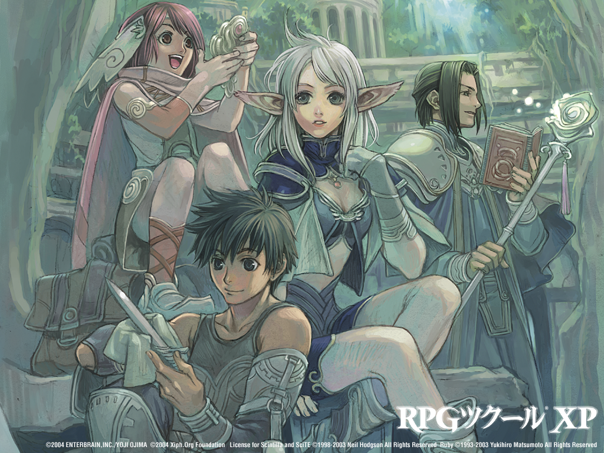

# AGM资料站

## 简介
> AGM是ActionGameMaker的简称，由Enterbrain公司开发的一款专门用于制作动作游戏的引擎。用户可通过简单的拖放来制作游戏，无需任何脚本语言。

* **AGM可用的分辨率**

4：3|320×240|640×480|800 x 600|1024×768
-|-|-|-|-
16：9|1280×720|1920×1080|-|-
其他|240×240|256×192|256×384|480×272

## 个人看法

> 由于年代已久而且官方早已停止更新了，如果是入门学习其实有更多好的`引擎`选择，比如`AGM`的兄弟姐妹，相信你没看过也听过，虽然他们大部分主要用于制作`角色扮演类`，但随着更新加入了强大的`脚本`功能，完全可以用来制作动作类游戏的，很多大佬制作了第三方的`库`直接用就得了。

游戏引擎|发售时间|最新版本|最近更新时间|脚本语言
-|-|-|-||
[RPGツクールMV]|2015年|1.6.2|2019.02.04|JS
[RPGツクールVX Ace]|2011.12.15|Ver.1.02b|2014.11.17|RGSS3
[RPGツクールVX VALUE!+]|2012.9月27|Ver.1.03b|2014.11.17|RGSS2
[RPGツクールXP VALUE!+]|2012.9月27|太老了|首次加入脚本功能|RGSS1
[RPGツクール2000 VALUE!+]|2012.9月27|太老了|不推荐|-

> 如果你有这个想法那么我建议你使用MV，根据表格你应该能看出来只有他还活着，相关介绍就到这里虽然这只是一部分还有其他`GM`、`GMS`、`U3D`、`虚幻`等引擎，相对来说可能入门门槛会高一点，但习惯后可能你会更喜欢他们!

[RPGツクールMV]:https://tkool.jp/mv/
[RPGツクールVX Ace]:https://tkool.jp/products/rpgvxace/index
[RPGツクールVX VALUE!+]:https://tkool.jp/products/rpgvx/index
[RPGツクールXP VALUE!+]:https://tkool.jp/products/rpgxp/index
[RPGツクール2000 VALUE!+]:https://tkool.jp/products/rpg2000/index

## 相关链接
 * [官网](https://tkool.jp/products/act/top)
 * [参考案例](http://tkool.jp/products/act/download.html)
 * [官方博客](http://smileboom.com/tkool/)
 * [更新记录](https://tkool.jp/support/download/act/act_update)

* #### 教程
    * [基础教程](https://tieba.baidu.com/p/5539546846?red_tag=0188458854)
    * [AGM制作马里奥游戏](http://v.youku.com/v_show/id_XMzAxMTYwNTk2.html)

* #### 社区
    * [幻想森林AGM专区](http://rpgchina.net/thread.php?fid=86)
    * [Project1 AGM专区](https://rpg.blue/forum.php?mod=forumdisplay&fid=77&typeid=1347)

* #### 在线游戏案例
    * [打飞机](https://tkool.jp/products/act/index)

* #### 资源站
    * **准备好梯子**
        * https://opengameart.org/
        * http://www.reinerstilesets.de/
        * https://kenney.nl/assets
        * https://game-icons.net/
        * https://www.models-resource.com/
    * **国内一些网站**
        * http://res.indienova.com/
        * http://www.aigei.com	
        * https://bbs.gameres.com/forum_163_1.html

